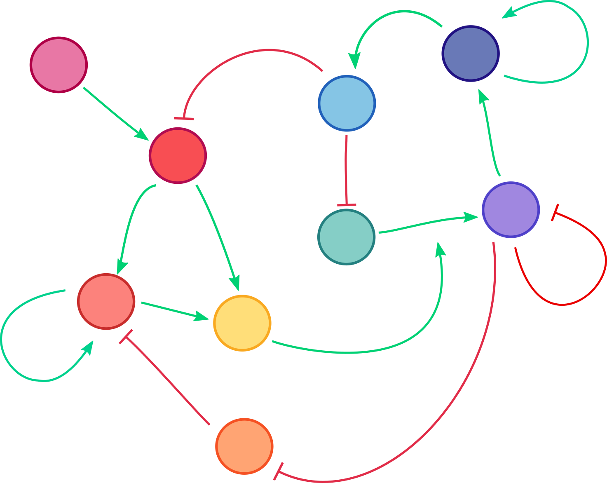

# network-modeling-summer-school-2021

<!-- PROJECT SHIELDS -->
[![Contributors][contributors-shield]][contributors-url]
[![Forks][forks-shield]][forks-url]
[![Stargazers][stars-shield]][stars-url]
[![Issues][issues-shield]][issues-url]
[![MIT License][license-shield]][license-url]


<!-- PROJECT LOGO -->
<br />
<p align="center">
  <a href="https://github.com/sys-bio/network-modeling-summer-school-2021">
    
  </a>

  <h3 align="center">network-modeling-summer-school-2021</h3>

  <p align="center">
    These materials were created for a week-long course on network modeling, 
in which participants learned how to construct, simulate, and validate a 
biochemical differential equation-based model using the model 
development package, Tellurium.

<br />
<br />
<a href="https://github.com/vporubsky/network-modeling-summer-school">View Demo</a>
·
<a href="https://github.com/vporubsky/network-modeling-summer-school/issues">Report Bug</a>

</p>
</p>


<!-- TABLE OF CONTENTS -->
<details open="open">
  <summary><h2 style="display: inline-block">Table of Contents</h2></summary>
  <ol>
    <li>
      <a href="#about-the-project">About The Project</a>
      <ul>
        <li><a href="#built-with">Built With</a></li>
      </ul>
    </li>
    <li>
      <a href="#getting-started">Getting Started</a>
      <ul>
        <li><a href="#prerequisites">Prerequisites</a></li>
        <li><a href="#installation">Installation</a></li>
      </ul>
    </li>
    <li><a href="#usage">Usage</a></li>
    <li><a href="#roadmap">Roadmap</a></li>
    <li><a href="#contributing">Contributing</a></li>
    <li><a href="#license">License</a></li>
    <li><a href="#contact">Contact</a></li>
    <li><a href="#acknowledgements">Acknowledgements</a></li>
  </ol>
</details>


<!-- ABOUT THE PROJECT -->
## About The Project

These materials were created for a week-long course on network modeling, 
in which participants learned how to construct, simulate, and validate a 
biochemical differential equation-based model using the model 
development package, Tellurium, and programming in Python. 

**A repository of Google Colaboratory notebooks for the course is also available:**
https://bit.ly/network_modeling_summer_school_2021_course_materials

### Built With

* []()
* []()
* []()


<!-- GETTING STARTED -->
## Getting Started

To get a local copy up and running follow these simple steps.

### Dependencies

Install the packages required to run the Jupyter notebooks contained in the repository.
* Tellurium modeling package
  ```sh
  pip install tellurium
  ```

### Installation

1. Clone the repo
   ```sh
   git clone https://github.com/sys-bio/network-modeling-summer-school-2021.git
   ```


<!-- USAGE EXAMPLES -->
## Usage

Add examples of how to use the repository materials and perform simple modeling exercies.


<!-- LICENSE -->
## License

Distributed under the MIT License. See `LICENSE` for more information.


<!-- CONTACT -->
## Contact

Veronica Porubsky - verosky@uw.edu

Project Link: [https://github.com/sys-bio/network-modeling-summer-school-2021](https://github.com/sys-bio/network-modeling-summer-school-2021)

<!-- ACKNOWLEDGEMENTS -->
## Acknowledgements


<!-- MARKDOWN LINKS & IMAGES -->
<!-- https://www.markdownguide.org/basic-syntax/#reference-style-links -->
[contributors-shield]: https://img.shields.io/github/contributors/github_username/repo.svg?style=for-the-badge
[contributors-url]: https://github.com/sys-bio/network-modeling-summer-school-2021/graphs/contributors
[forks-shield]: https://img.shields.io/github/forks/github_username/repo.svg?style=for-the-badge
[forks-url]: https://github.com/sys-bio/network-modeling-summer-school-2021/network/members
[stars-shield]: https://img.shields.io/github/stars/github_username/repo.svg?style=for-the-badge
[stars-url]: https://github.com/sys-bio/network-modeling-summer-school-2021/stargazers
[issues-shield]: https://img.shields.io/github/issues/github_username/repo.svg?style=for-the-badge
[issues-url]: https://github.com/sys-bio/network-modeling-summer-school-2021/issues
[license-shield]: https://img.shields.io/github/license/github_username/repo.svg?style=for-the-badge
[license-url]: https://github.com/sys-bio/network-modeling-summer-school-2021/blob/master/LICENSE.txt